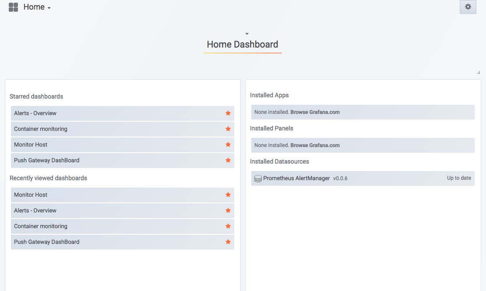
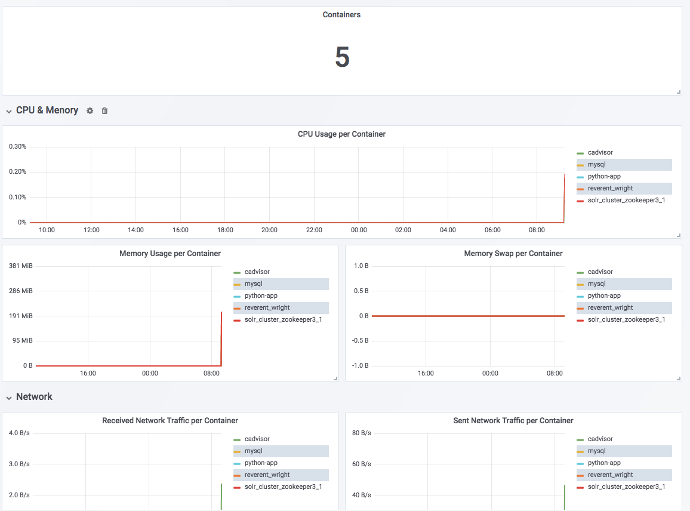
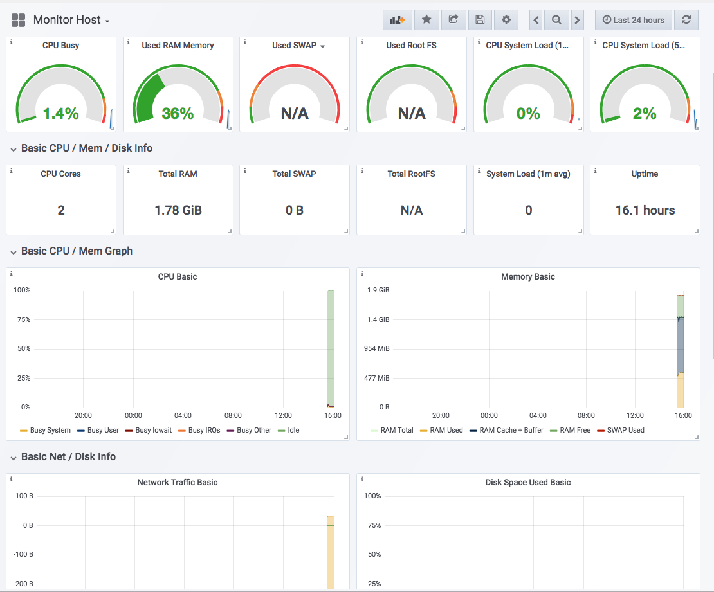

# Monitoring with Prometheus

## Install Prometheus with docker-compose

This document for install Prometheus to monitoring  container:

System diagram:


Components:
- Prometheus Server 
- Scrape targets   (Consul)
- Web UI (Graphana)
- Alert Managerment (Email, webhook, Slack income-webhook)
- Exporter monitor Docker (Cadvisor)
- Pushgateway (exception case) 


### Step setup system

* requirements:
  - Centos 7
  - Docker deamon
  - docker-compose 1.22.0


1. Clone source:

`git clone https://github.com/dongvothanh/monitoring-container.git`


2. Starting setup

Start script init because on `centos` with start  container `Cadvisor` is failed beacause not find `/sys/fs/cgroup/cpu,cpuacct`.
```
cd monitoring-container
bash init_script.sh
```

run docker-compose

`docker-compose up --build  -d`

```
[root@monitor-server docker]# docker-compose up --build  -d
Pulling alert-dashboard (cloudflare/unsee:v0.9.2)...
Trying to pull repository docker.io/cloudflare/unsee ...
v0.9.2: Pulling from docker.io/cloudflare/unsee
088cabda8f41: Pull complete
83a98536d0a7: Pull complete
Digest: sha256:bac217ebeb52ba6cf31dbb3913a2787f3696841e10982553f68a74784b7dfbf7
Status: Downloaded newer image for docker.io/cloudflare/unsee:v0.9.2
Pulling grafana (grafana/grafana:5.2.3)...
Trying to pull repository docker.io/grafana/grafana ...
5.2.3: Pulling from docker.io/grafana/grafana
2a72cbf407d6: Pull complete
9ad72e180f95: Pull complete
bb485c40cb27: Pull complete
Digest: sha256:86d8159672941cafb67f2d1a134d119ba7f7aa933e801e98bf6e18bc94394203
Status: Downloaded newer image for docker.io/grafana/grafana:5.2.3
Building prometheus
Step 1/8 : FROM prom/prometheus:v2.3.2
Trying to pull repository docker.io/prom/prometheus ...
v2.3.2: Pulling from docker.io/prom/prometheus
f70adabe43c0: Already exists
b91f96ddd9e3: Already exists
994a5dff18b9: Pull complete
c212a2ec4e0a: Pull complete
d4c364c9eaa4: Pull complete
0dfcc5400262: Pull complete
bd67036502b8: Pull complete
82302c0a52e0: Pull complete
1527901688d6: Pull complete
Digest: sha256:7d99455a045a6c89c0dbee6e1fe659eb83bd3a19e171606bc0fd10eb0e34a7dc
Status: Downloaded newer image for docker.io/prom/prometheus:v2.3.2
 ---> 0915a968017e
Step 2/8 : MAINTAINER mrneodiablo
 ---> Running in 91281754b2a1
 ---> 828ad0793ac5
Removing intermediate container 91281754b2a1
Step 3/8 : RUN mkdir /etc/prometheus/config/rules -p
 ---> Running in 7fcc8e9c9619

 ---> 29e7f3bd7a9f
Removing intermediate container 7fcc8e9c9619
Step 4/8 : COPY prometheus.yml /etc/prometheus/config/prometheus.yml
 ---> 14b9128ec0e4
Removing intermediate container 9054b2bae340
Step 5/8 : COPY rules /etc/prometheus/config/rules
 ---> 19812ab901c1
Removing intermediate container 9c017693dfc3
Step 6/8 : EXPOSE 9090
 ---> Running in 4bb68193dd1d
 ---> 57adeb0e9fe5
Removing intermediate container 4bb68193dd1d
Step 7/8 : ENTRYPOINT /bin/prometheus
 ---> Running in 584f3639f6ae
 ---> 8a8b2cf603e4
Removing intermediate container 584f3639f6ae
Step 8/8 : CMD --config.file=/etc/prometheus/config/prometheus.yml --storage.tsdb.path=/prometheus --web.console.libraries=/etc/prometheus/console_libraries --web.console.templates=/etc/prometheus/consoles
 ---> Running in ebef31bad182
 ---> 557f961b1797
Removing intermediate container ebef31bad182
Successfully built 557f961b1797
Pulling nodeexporter (prom/node-exporter:latest)...
Trying to pull repository docker.io/prom/node-exporter ...
latest: Pulling from docker.io/prom/node-exporter
224a21997e8c: Pull complete
cdb7590af5f0: Pull complete
528dda9cf23d: Pull complete
Digest: sha256:55302581333c43d540db0e144cf9e7735423117a733cdec27716d87254221086
Status: Downloaded newer image for docker.io/prom/node-exporter:latest
Pulling client-intergration (philwinder/prometheus-python:0.1.4)...
Trying to pull repository docker.io/philwinder/prometheus-python ...
0.1.4: Pulling from docker.io/philwinder/prometheus-python
b56ae66c2937: Pull complete
38e9efcae657: Pull complete
c83f48418b5e: Pull complete
e035ffa35a88: Pull complete
3d9512281ac0: Pull complete
d11d57ee4dd6: Pull complete
37120fd5eb2e: Pull complete
67a0e9326ef1: Pull complete
d89df4254a25: Pull complete
Digest: sha256:57c59dfbd2313356a55d69c41266a311462678930022a74d0d9fef372d364738
Status: Downloaded newer image for docker.io/philwinder/prometheus-python:0.1.4
Pulling cadvisor (google/cadvisor:v0.28.5)...
Trying to pull repository docker.io/google/cadvisor ...
v0.28.5: Pulling from docker.io/google/cadvisor
81033e7c1d6a: Pull complete
2b6f4f5e677d: Pull complete
d5b3665595c3: Pull complete
Digest: sha256:65b61320545ff5b88aadde51003f1935a5a9b4119a4abc36aac82b2cf20e8ad4
Status: Downloaded newer image for docker.io/google/cadvisor:v0.28.5
Building servicepush
Step 1/10 : FROM guyton/centos6:latest
Trying to pull repository docker.io/guyton/centos6 ...
latest: Pulling from docker.io/guyton/centos6
987d765a926d: Pull complete
89357cbf7405: Pull complete
18de72061a37: Pull complete
Digest: sha256:d2a3edd875ae7770f7d839ffe01696dd5ec7e9b776fcc54e9a15ba27dd14c866
Status: Downloaded newer image for docker.io/guyton/centos6:latest
 ---> 89e582eff18a
Step 2/10 : MAINTAINER mrneodiablo
 ---> Running in 6fec0e6f70d1
 ---> 775ee5129aed
Removing intermediate container 6fec0e6f70d1
Step 3/10 : RUN mkdir /service
 ---> Running in 47fa85882656

 ---> 7f28b9310750
Removing intermediate container 47fa85882656
Step 4/10 : COPY service.json /service/service.json
 ---> 798b8b0ecae7
Removing intermediate container bc11f9b674e9
Step 5/10 : COPY pushgateway.json /service/pushgateway.json
 ---> beaafc7d29fa
Removing intermediate container 63f0d09a1910
Step 6/10 : COPY node.json /service/node.json
 ---> 276df071cfc6
Removing intermediate container c12cce44e7c4
Step 7/10 : COPY container.json /service/container.json
 ---> 2b84000f3b1c
Removing intermediate container b176fc028b2d
Step 8/10 : COPY servicepus.sh /service/servicepus.sh
 ---> 1f02b4b5fcec
Removing intermediate container 679448a5f0cd
Step 9/10 : RUN chmod +x /service/servicepus.sh
 ---> Running in 00ae8f393a78

 ---> e8127e05064e
Removing intermediate container 00ae8f393a78
Step 10/10 : ENTRYPOINT ./service/servicepus.sh
 ---> Running in 27ac8e2e7c49
 ---> 7adedbbdf559
Removing intermediate container 27ac8e2e7c49
Successfully built 7adedbbdf559
Creating docker_pushgateway_1         ... done
Creating docker_alert-dashboard_1     ... done
Creating docker_client-intergration_1 ... done
Creating docker_consul_1              ... done
Creating prometheus                   ... done
Creating docker_grafana_1             ... done
Creating servicepush                  ... done
Creating docker_nodeexporter_1        ... done
Creating docker_cadvisor_1            ... done
Creating docker_alertmanager_1        ... done
```

check after run

```
[root@monitor-server docker]# docker ps
CONTAINER ID        IMAGE                                COMMAND                  CREATED             STATUS              PORTS                                                                                                                          NAMES
73489bbec8f6        prom/alertmanager:v0.15.2            "/bin/alertmanager..."   10 seconds ago      Up 5 seconds        0.0.0.0:9093->9093/tcp                                                                                                         docker_alertmanager_1
4878fca16cfe        google/cadvisor:v0.28.5              "/usr/bin/cadvisor..."   10 seconds ago      Up 6 seconds        0.0.0.0:1337->8080/tcp                                                                                                         docker_cadvisor_1
c46401afd056        servicepush_dongvt:v1                "./service/service..."   10 seconds ago      Up 6 seconds                                                                                                                                       servicepush
a9bde58778eb        prom/node-exporter:latest            "/bin/node_exporter"     10 seconds ago      Up 5 seconds        0.0.0.0:9100->9100/tcp                                                                                                         docker_nodeexporter_1
cfdfe5c3ee1f        grafana/grafana:5.2.3                "/run.sh"                10 seconds ago      Up 6 seconds        0.0.0.0:3000->3000/tcp                                                                                                         docker_grafana_1
5d07da29059f        consul:1.2.2                         "docker-entrypoint..."   10 seconds ago      Up 5 seconds        0.0.0.0:8400->8400/tcp, 0.0.0.0:8500->8500/tcp, 8300-8302/tcp, 8301-8302/udp, 0.0.0.0:8600->8600/tcp, 0.0.0.0:8600->8600/udp   docker_consul_1
98dd18358852        cloudflare/unsee:v0.9.2              "/unsee"                 10 seconds ago      Up 6 seconds        0.0.0.0:8080->8080/tcp                                                                                                         docker_alert-dashboard_1
318ded513d65        prometheus_dongvt:v1                 "/bin/prometheus -..."   10 seconds ago      Up 6 seconds        0.0.0.0:9090->9090/tcp                                                                                                         prometheus
a195b96d6a0d        prom/pushgateway:v0.5.2              "/bin/pushgateway"       10 seconds ago      Up 8 seconds        0.0.0.0:9091->9091/tcp                                                                                                         docker_pushgateway_1
5f0db100f503        philwinder/prometheus-python:0.1.4   "python ./app.py"        10 seconds ago      Up 8 seconds        0.0.0.0:5000->5000/tcp                                                                                                         docker_client-intergration_1
```

All container have started

3. Access `grafana` 

Import file configs dashboard in `setup/grafana/` to `Grafana`


port: `3000`

==> Result:

Home Dashboard 




===================

Container Dashboard 



===================

Host Dashboard 

